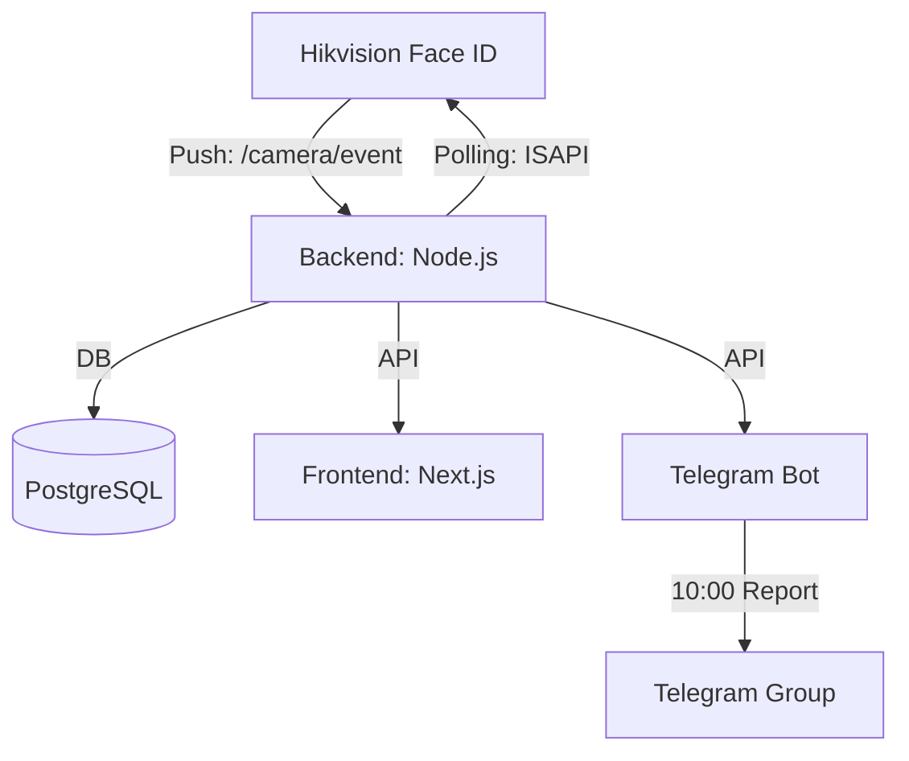

# 🚀 HR-Monitor: Hikvision Face ID Davomat Tizimi

Ushbu loyiha Hikvision Face ID terminallari yordamida xodimlarning keldi-ketdi vaqtlarini avtomatik ro'yxatga olish, ma'lumotlarni Telegram guruhga hisobot shaklida yuborish va vizual Dashboard orqali kuzatish imkonini beradi.

---

## 🏗️ Tizim Arxitekturasi

Loyihaning ishlash sxemasi:



---

## 🛠️ Texnologiyalar

| Qism | Texnologiya |
|------|-------------|
| **Backend** | Node.js, TypeScript, Express, Sequelize (ORM) |
| **Frontend** | Next.js, Tailwind CSS, Vercel |
| **Bot** | Grammy.js, Node-cron |
| **Baza** | PostgreSQL |
| **Sinxronlash** | Hikvision ISAPI (CURL Digest Auth) |

---

## 📁 Loyiha Tuzilishi

- `/backend`: Markaziy API server va kameralar bilan sinxronlash xizmati.
- `/frontend`: Rahbarlar uchun vizual Dashboard (Vercel da joylashgan).
- `/bot`: Xodimlar uchun interfeys va menejerlar uchun hisobot boti.
- `/backend/cameras.json`: Barcha ulangan kameralar ro'yxati (Konfiguratsiya).

---

## ⚙️ Sozlama va Ishga tushirish

### 1. Backend Sozlamalari
`backend/.env` faylini yarating:
```env
PORT=
DB_HOST=
DB_USER=
DB_PASSWORD=
DB_NAME=
BOT_TOKEN=
MANAGERS_CHAT_ID=
```

### 2. Kameralarni qo'shish (`cameras.json`)
Yangi filial yoki kamera qo'shish uchun faqat `backend/cameras.json` fayliga quyidagi formatda ma'lumot qo'shing:
```json
[
  {
    "name": "",
    "ip": "",
    "user": "",
    "pass": ""
  }
]
```
**Eslatma:** Yangi kamera qo'shilgandan so'ng backendni restart qilsangiz, tizim avtomatik ravishda ushbu kameradan xodimlarni va davomatni o'qib olishni boshlaydi.

### 3. Kamerani (Face ID) sozlash
Kamera serverga ma'lumot yuborishi uchun uning veb-interfeysida:
- **Server Address**: Serveringizning IP manzili (Lokal yoki Public).
- **Port**: `4000`.
- **URL Path**: `/camera/event`.
- **Protocol**: `HTTP`.

---

## 🔄 Ma'lumotlar oqimi (Sync Logic)

Tizimda davomat **ikki xil usulda** olinadi:

1. **Push (Real-time):** Kamera kimnidir tanisa, serverga HTTP POST so'rov yuboradi. Backend buni darhol bazaga yozadi.
2. **Polling (Har 2 daqiqa):** Agar internet yoki tarmoq uzilib qolsa, backend har 2 daqiqada kameraning xotirasini (`ISAPI/AccessControl/AcsEvent`) tekshiradi va tushib qolgan ma'lumotlarni bazaga qo'shib qo'yadi.

> [!IMPORTANT]
> Xodimlarni Telegram akkaunti bilan bog'lash uchun, xodim botga kirib `/start` bosishi va **kontaktini ulashishi** shart.

---

## 📊 Hisobotlar

- **Frontend Dashboard:** Barcha xodimlarning keldi-ketdi vaqtlari, kechikishlar va sabablar real vaqtda ko'rinadi.
- **Telegram Guruh:** Har kuni soat **10:00 da** `bot/index.ts` dagi cron-job orqali barcha filiallar bo'yicha umumiy hisobot yuboriladi.

---

## 🚀 Kelajakda Davom Ettirish Uchun (Maintenance)

Dasturchilar uchun maslahatlar:
- **Yangi filial qo'shish:** Faqat `cameras.json` fayliga yangi kamera ma'lumotlarini qo'shing. Branch jadvalida filial nomi avtomatik yaratiladi.
- **Sinxronlash vaqtini o'zgartirish:** `backend/src/services/camera_sync.ts` faylidagi cron-job parametrlarini o'zgartiring.
- **Loglarni kuzatish:** PM2 ishlatilsa, `pm2 logs` orqali kameradan kelayotgan JSON so'rovlarini ko'rish mumkin.

---

### 📞 Muammo bo'lsa
Agar kamera bilan ulanishda xato bo'lsa:
1. Serverdan kameraga `ping` borligini tekshiring.
2. Kamerada `CURL Digest Auth` yoqilganligiga ishonch hosil qiling.
3. Serverda `4000` porti firewall tomonidan to'silmaganligini tekshiring.
